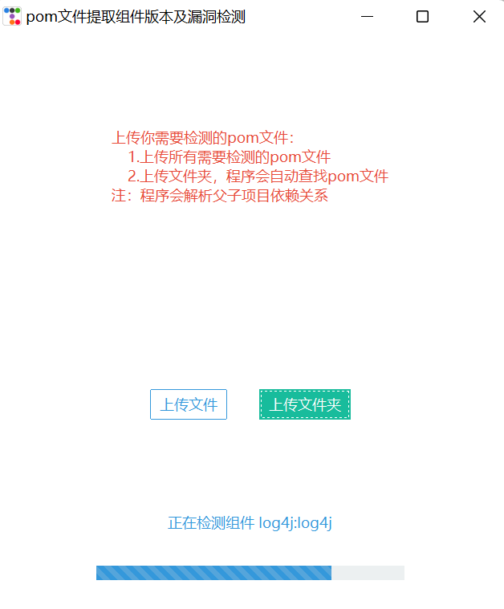
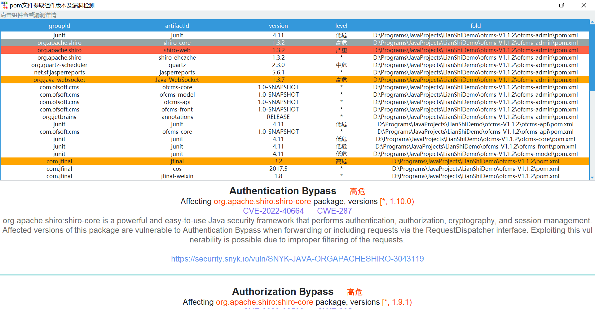
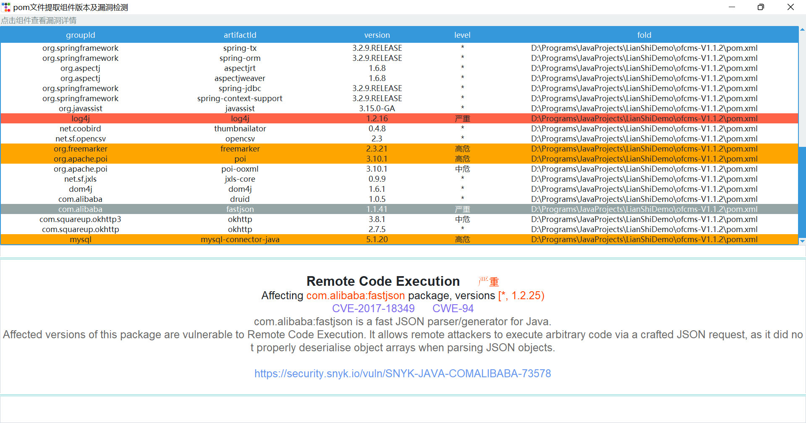

# PomEye
 一款根据pom.xml获取引用的第三方组件的版本号并识别组件漏洞的工具
[FreeBuf传送门](https://www.freebuf.com/sectool/366383.html)

## 简介

一款根据pom.xml获取引用的第三方组件的版本号并识别组件漏洞的工具

+ 精致、优美、易使用的图形化用户界面
+ 使用BeautifulSoup4解析pom.xml文件，速度快、不出错
+ 根据pom.xml文件中的`<parent>`标签构建父子关系树，当子项目的组件版本未知时递归的查找其父项目的该组件的版本号
+ 利用第三方漏洞库snyk检测组件漏洞，显示漏洞名称、危险等级、影响版本、漏洞详情及snyk参考链接

## 运行方法

```cmd
python main.py
```

## 运行截图







